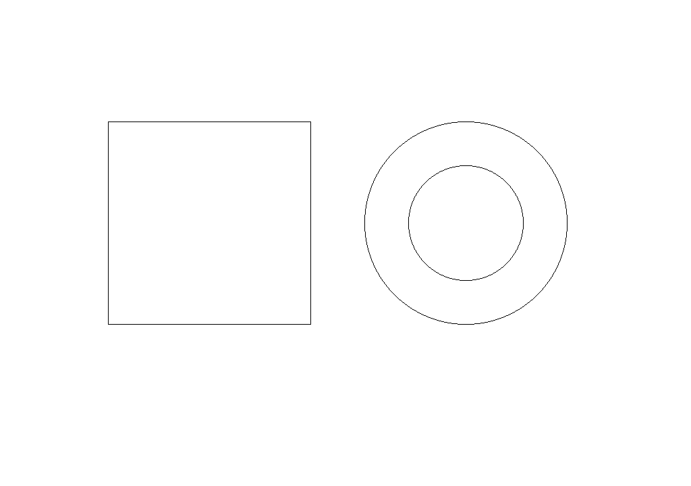
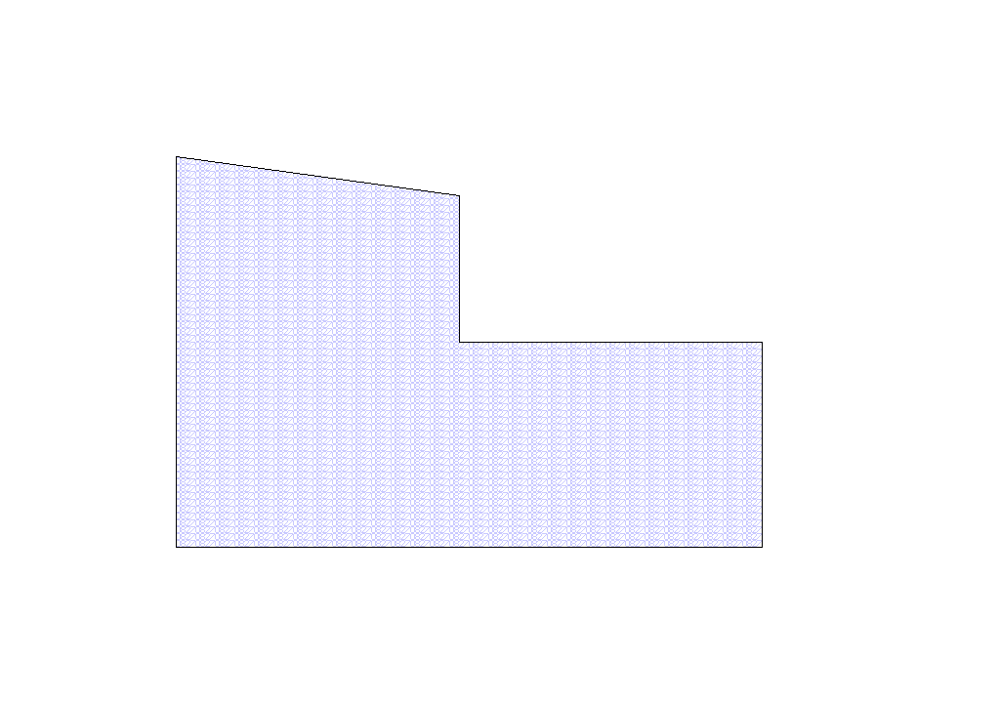
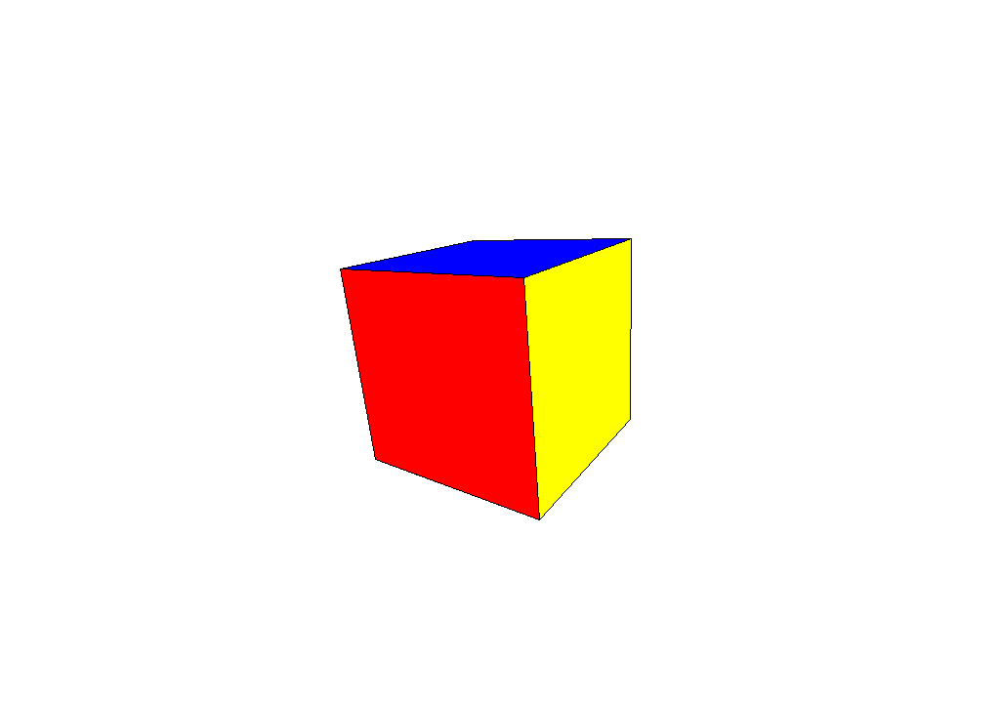
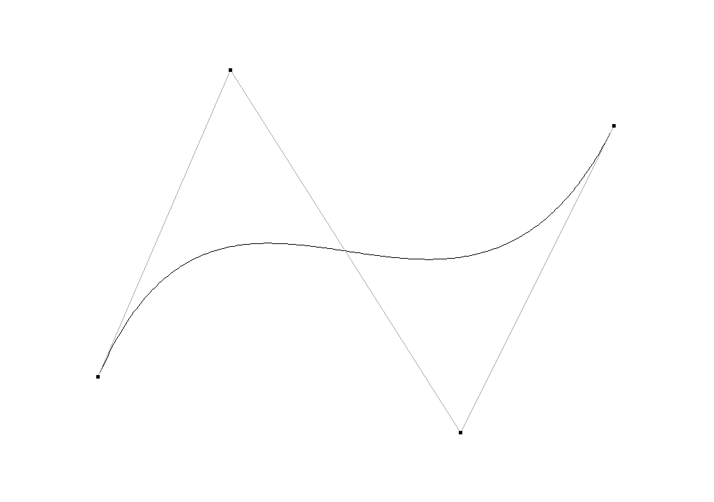

# Graphics Algorithms Lab

**计算机图形学课程项目 · C++17 / SDL2 / Windows**

一个用于交互观察基础图形学算法的小型程序：在 CPU 像素缓冲区中绘制二维图元、填充多边形、投影三维立方体，并通过控制点生成三次 Bézier 曲线。SDL2 负责窗口、输入事件和像素缓冲区显示，图元与曲线由项目中的算法绘制。

本项目由 2025 年的计算机图形学课设整理而来，保留原有四类实验与[课程报告](docs/course-report.docx)。整理重点是可复现构建、交互反馈和代码可读性，定位为基础算法实践，不是完整渲染引擎。

## 运行效果

以下图片由当前程序的示例场景直接导出，可用 `F1` 在对应模式下重现。

| 二维图元 | 扫描线图案填充 |
| --- | --- |
|  |  |
| **立方体变换与透视投影** | **三次 Bézier 曲线与控制多边形** |
|  |  |

## 实现内容

| 模块 | 实现方法 | 交互方式 |
| --- | --- | --- |
| 二维绘制 | Bresenham 直线、整数中点圆；矩形由四条线段组成 | 鼠标拖拽、修改线条颜色 |
| 区域填充 | 逐扫描线求交、排序与交点配对；使用 5×7 点阵重复铺设 `0827` 图案 | 逐点定义多边形、右键闭合、修改填充与边界颜色 |
| 三维变换 | 绕世界原点的 X/Y/Z 轴旋转与平移、透视投影、按面平均深度排序绘制 | 选择变换轴，用 `+/-` 调整，设置步长与角度 |
| 曲线绘制 | Bernstein 多项式形式的三次 Bézier 曲线，200 段采样并连接 | 依次指定四个控制点，显示控制多边形 |

算法位于 [`src/graphics.hpp`](src/graphics.hpp)，窗口、对话框和输入处理位于 [`src/main.cpp`](src/main.cpp)。线段与填充循环限制在视口内，避免屏幕外坐标导致无意义的大范围遍历。

## 快速开始（Windows x64）

需要已有 **64 位 MinGW-w64 `g++`（支持 C++17）**、PowerShell 5.1+ 和 `tar`。首次构建需要联网下载 SDL2 2.32.6；脚本会校验固定 SHA-256。

```powershell
git clone https://github.com/TinaAlbert/graphics-algorithms-lab.git
cd graphics-algorithms-lab
powershell -NoProfile -ExecutionPolicy Bypass -File scripts/build.ps1 -Test
.\build\graphics-lab.exe
```

若编译器不在 PATH，或下载需要代理：

```powershell
.\scripts\build.ps1 -Compiler 'D:\path\to\mingw64\bin\g++.exe' -Proxy 'http://127.0.0.1:7897' -Test
```

脚本不会安装编译器、修改全局 PATH 或写入系统依赖目录。下载依赖位于本项目 `.deps/`，临时文件位于 `.cache/`，编译结果位于 `build/`；这些目录均被 Git 忽略。运行时保留 `build/` 中的 DLL 与可执行文件在同一目录。

已有 Visual Studio / CMake 环境也可使用 [`CMakeLists.txt`](CMakeLists.txt)，详见[构建与验证说明](docs/development.md)。当前已实测的是 MinGW 构建路径。

## 操作说明

先单击画布让窗口获得焦点，再使用快捷键；输入法请切换为英文。**键盘操作在画布窗口完成，不在终端输入。** 窗口标题显示当前模式和操作提示，终端提供中文说明。

| 模式 | 快捷键 | 操作 |
| --- | --- | --- |
| 图元 | `G` → `1` / `2` | 拖拽绘制矩形 / 从圆心拖拽指定半径 |
| 图元颜色 | `G` → `3` | 选择颜色后，按 `1` 或 `2` 返回绘制工具 |
| 区域填充 | `A` → `1` | 左键添加顶点，至少三个点后右键闭合 |
| 填充颜色 | `A` → `2` | 依次选择填充色和边界色，再按 `1` 返回绘制 |
| 立方体 | `T` → `1` | 重置立方体 |
| 平移 | `T` → `2` / `3` / `4` | 选择 X / Y / Z 轴，再按 `=` 或 `+` 正向、`-` 反向 |
| 旋转 | `T` → `5` / `6` / `7` | 选择 X / Y / Z 轴，再按 `+/-` 旋转 |
| 参数 | `T` → `8` | 设置平移步长（整数 1–1000）和旋转角度（大于 0，不超过 360°） |
| 曲线 | `B` → `1` | 连续点击四个控制点，自动生成一条曲线 |
| 示例 | `F1` | 替换当前模式内容为示例；其他模式内容保留 |
| 导出 | `F2` | 将当前画布保存为工作目录下的 `canvas.bmp`，同名文件会覆盖 |
| 清空 / 退出 | `K` / `Esc` | 清空当前模式；三维模式下重置立方体 / 退出 |

启动时默认选中矩形工具。切换模式会保留各模式中的图形；颜色是全局样式，同类已有图形也会随颜色设置更新。

## 项目结构

```text
src/                  图形算法与交互程序
tests/                不依赖 SDL2 的算法回归测试
scripts/              构建、测试及预览图导出
docs/                 原始课设报告、技术说明、实际渲染预览
CMakeLists.txt        可选 CMake 构建入口
THIRD_PARTY_NOTICES.md 第三方依赖说明
```

## 范围与限制

- 图形界面使用 Windows 原生颜色和参数对话框，当前不提供跨平台 GUI。
- 三维部分仅演示单个立方体，使用画家算法而非 Z-buffer；面与近裁剪面相交时会被跳过，尚未实现完整的三维裁剪。
- 旋转绕世界原点进行，平移后再旋转会产生绕原点运动；屏幕 Y 轴向下。
- 曲线使用固定采样数；尚无抗锯齿、撤销、控制点拖动和场景文件保存。
- 数字填充图案沿用原课设的 `0827`，字模在 `initFont()` 中定义。

欢迎用作学习参考；课程提交请遵守所在课程的独立完成要求。SDL2 与运行库说明见 [THIRD_PARTY_NOTICES.md](THIRD_PARTY_NOTICES.md)。
